```mermaid
flowchart TB
  %% === External Sources ===
  subgraph Sources["📰 RSS SOURCES (Step 1: Where News Comes From)"]
    direction LR
    OA["OpenAI Blog"]
    GAI["Google AI Blog"]
    MIT["MIT Tech Review"]
    PWC["Papers With Code"]
    TC["TechCrunch AI"]
    VB["VentureBeat AI"]
    VERGE["The Verge AI"]
    HF["Hugging Face"]
    MS["Microsoft AI"]
    AMZ["Amazon Science"]
    NV["NVIDIA Blog"]
  end

  %% === Scheduler ===
  subgraph Scheduler["⏰ EVENTBRIDGE SCHEDULER (Step 2: The Alarm Clock)"]
    SCH["Wakes up every hour<br/>Tells Lambda: 'Go fetch news now!'<br/><br/>💡 WHY: Automates the process<br/>so you don't have to manually<br/>trigger the fetching"]
  end

  %% === Producer (Lambda) ===
  subgraph Lambda["🤖 LAMBDA PRODUCER (Step 3: The Collector)"]
    direction TB
    L1["<b>START</b><br/>Function triggered"]
    L2["<b>FETCH</b><br/>Download RSS feeds from<br/>all 11 sources in parallel<br/><br/>💡 Runs serverless - only<br/>pay for the 30 seconds<br/>it takes to fetch"]
    L3["<b>TRANSFORM</b><br/>Convert XML → JSON<br/>Extract: title, link, date, source<br/><br/>💡 Standardizes different<br/>RSS formats into one<br/>consistent structure"]
    L4["<b>SEND</b><br/>Batch 10 articles at a time<br/>Push to SQS queue<br/><br/>💡 Batching = fewer API<br/>calls = lower cost"]
  end

  %% === Queue ===
  subgraph SQS["📬 SQS QUEUE (Step 4: The Safe Mailbox)"]
    direction TB
    Q1["Queue: ai-news-raw"]
    Q2["<b>STORES</b> messages until consumed<br/><br/>💡 WHY THIS IS CRITICAL:<br/>• If EC2 crashes, messages wait here<br/>• If Lambda produces 1000 articles,<br/>  EC2 processes them at its own pace<br/>• Decouples producer from consumer<br/>• Messages stay up to 14 days"]
  end

  %% === Consumer (EC2) ===
  subgraph EC2["🔄 EC2 CONSUMER (Step 5: The 24/7 Worker)"]
    direction TB
    C1["<b>RUNS CONTINUOUSLY</b><br/>systemd service 'newsfeed-consumer'<br/><br/>💡 WHY EC2 NOT LAMBDA:<br/>• Needs to run 24/7 polling<br/>• Lambda charges per invocation<br/>• EC2 t3.micro = ~$8/month flat"]
    C2["<b>LONG-POLL</b><br/>Asks SQS: 'Any new messages?'<br/>Waits up to 20 seconds<br/><br/>💡 Long-polling = efficient<br/>Doesn't spam AWS API"]
    C3["<b>PARSE</b><br/>Read article JSON<br/>Validate structure"]
    C4["<b>FILTER</b><br/>Check if article mentions:<br/>AI, GPT, LLM, transformer, etc.<br/><br/>💡 Only saves relevant articles<br/>Reduces database bloat"]
    C5["<b>CLEANUP</b><br/>Delete message from SQS<br/>so it's not processed again<br/><br/>💡 If processing fails,<br/>message stays in queue<br/>and retries automatically"]
  end

  %% === Database ===
  subgraph DB["💾 DYNAMODB (Step 6: The Permanent Storage)"]
    direction TB
    D1["Table: AINewsArticles"]
    D2["<b>STORES</b> filtered articles<br/>Partition key: id (unique)<br/>Sort key: publishedAt (time)<br/><br/>💡 WHY DYNAMODB:<br/>• NoSQL = fast for simple reads<br/>• Scales automatically<br/>• Pay per request<br/>• No server to manage"]
  end

  %% === Frontend ===
  subgraph FE["🌐 FRONTEND (Step 7: What You See)"]
    direction TB
    F1["<b>QUERY</b><br/>Scan DynamoDB table<br/>Get latest articles"]
    F2["<b>SORT</b><br/>Order by publishedAt DESC<br/>Newest articles first"]
    F3["<b>DISPLAY</b><br/>Render Next.js page<br/>Show title, source, time ago<br/><br/>💡 Frontend NEVER fetches<br/>RSS directly - just reads<br/>from database"]
  end

  %% === Observability ===
  subgraph Obs["📊 MONITORING (How You Debug Issues)"]
    direction TB
    CWL["<b>CloudWatch Logs</b><br/>Lambda execution logs<br/>EC2 systemd logs"]
    SQSM["<b>SQS Metrics</b><br/>Messages sent/received<br/>Messages in queue"]
    DDBM["<b>DynamoDB Metrics</b><br/>Read/write capacity<br/>Item count"]
  end

  %% === Flow ===
  Sources --> |"Every hour"| SCH
  SCH --> |"Trigger"| L1
  L1 --> L2
  L2 --> L3
  L3 --> L4
  L4 --> |"SendMessageBatch"| Q1
  Q1 --> Q2
  Q2 --> |"ReceiveMessage (long-poll)"| C2
  C2 --> C3
  C3 --> C4
  C4 --> |"✅ Matches keywords"| D1
  C4 --> |"✅ Delete processed message"| C5
  C5 --> Q1
  D1 --> D2
  D2 --> F1
  F1 --> F2
  F2 --> F3

  %% === Monitoring taps ===
  L1 -.-> |"Logs"| CWL
  C1 -.-> |"Logs"| CWL
  Q1 -.-> |"Metrics"| SQSM
  D1 -.-> |"Metrics"| DDBM

  %% === Styling ===
  classDef sourceStyle fill:#e1f5ff,stroke:#0288d1,stroke-width:2px
  classDef scheduleStyle fill:#fff9c4,stroke:#f9a825,stroke-width:2px
  classDef lambdaStyle fill:#c8e6c9,stroke:#388e3c,stroke-width:2px
  classDef queueStyle fill:#ffe0b2,stroke:#f57c00,stroke-width:3px
  classDef ec2Style fill:#f8bbd0,stroke:#c2185b,stroke-width:3px
  classDef dbStyle fill:#d1c4e9,stroke:#512da8,stroke-width:2px
  classDef feStyle fill:#b2dfdb,stroke:#00796b,stroke-width:2px
  classDef obsStyle fill:#e0e0e0,stroke:#616161,stroke-width:1px,stroke-dasharray: 5 5

  class Sources sourceStyle
  class Scheduler scheduleStyle
  class Lambda lambdaStyle
  class SQS queueStyle
  class EC2 ec2Style
  class DB dbStyle
  class FE feStyle
  class Obs obsStyle
```

---

## 🎯 KEY CONCEPTS EXPLAINED

### 1️⃣ **Producer-Consumer Pattern**
- **Producer (Lambda)**: Creates data (fetches RSS)
- **Queue (SQS)**: Buffer between them
- **Consumer (EC2)**: Processes data (filters & saves)

**Why not have Lambda write directly to DynamoDB?**
- If Lambda crashes mid-process, you lose data
- If you get 10,000 articles at once, DynamoDB might throttle
- SQS acts as a shock absorber

### 2️⃣ **Why EC2 Runs 24/7**
Think of it like a security guard:
- Lambda = Someone who visits once an hour
- EC2 = Someone who sits there all day watching

For continuous polling, EC2 is cheaper than Lambda making thousands of calls per day.

### 3️⃣ **Message Lifecycle**
```
1. Lambda creates message → SQS
2. SQS stores message safely
3. EC2 reads message (but doesn't delete yet)
4. EC2 processes message
5. ✅ If successful → EC2 deletes message
6. ❌ If failed → Message stays in queue → retry later
```

### 4️⃣ **What Happens When Things Break**

| Component Fails | What Happens | Data Loss? |
|----------------|--------------|------------|
| Lambda crashes | Messages in SQS wait | ❌ No |
| EC2 crashes | Messages stay in SQS until EC2 restarts | ❌ No |
| SQS (AWS issue) | Extremely rare, AWS handles redundancy | ❌ No |
| DynamoDB fails | EC2 retries, message stays in SQS | ❌ No |

**The Queue is Your Safety Net** 🛟

### 5️⃣ **Cost Breakdown** (Approximate)
- **Lambda**: ~$0.20/month (runs 1 min/hour)
- **SQS**: ~$0.50/month (1M requests free tier)
- **EC2 t3.micro**: ~$7.50/month (24/7)
- **DynamoDB**: ~$1-5/month (on-demand pricing)
- **Total**: ~$10/month

### 6️⃣ **Why This Architecture is Good**
✅ **Reliable**: Queue prevents data loss
✅ **Scalable**: Can add more EC2 consumers if needed
✅ **Cost-effective**: Only pay for what you use
✅ **Simple**: Each component does ONE thing
✅ **Observable**: Logs and metrics everywhere
